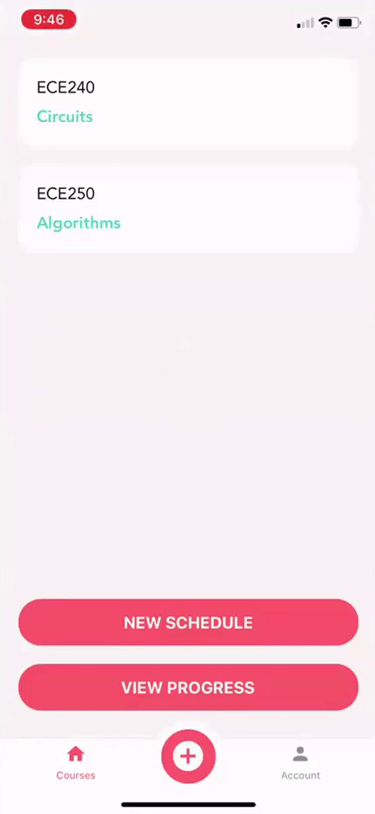
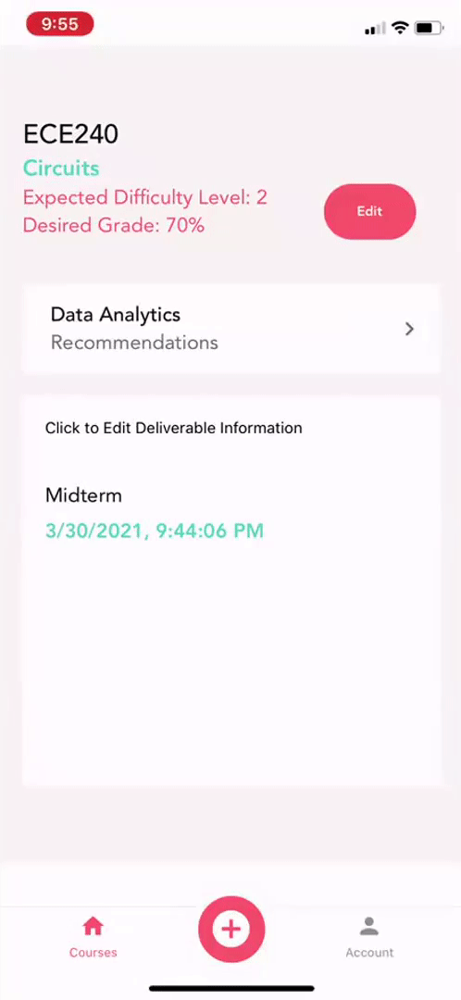
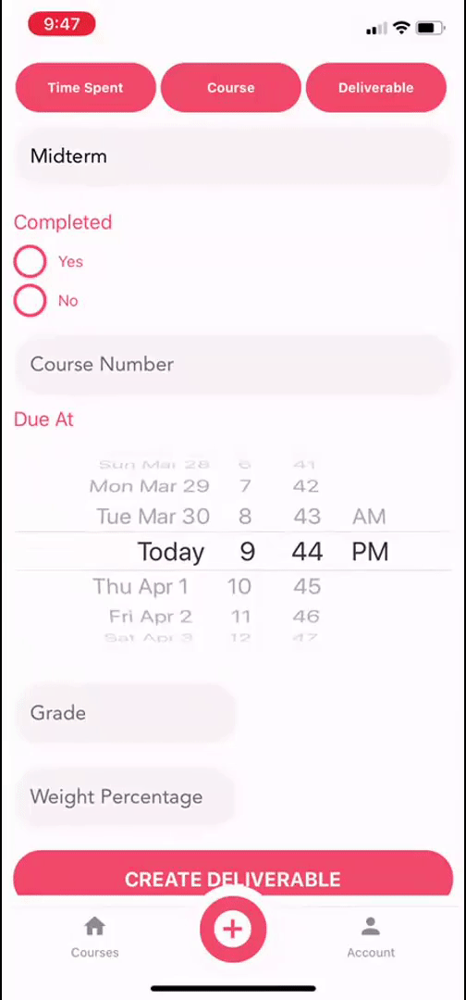
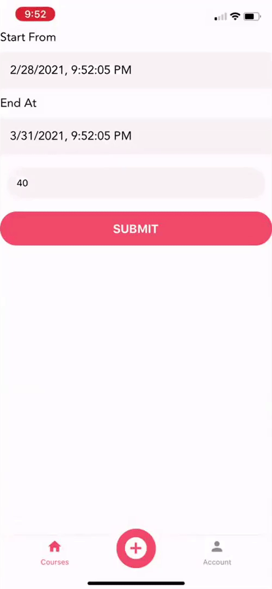
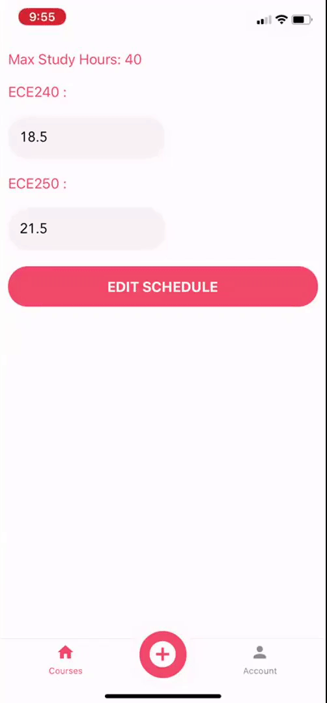

# School Assistant: ML-Powered Schedule App for Students

School Assistant is a simple scheduling app that uses school schedule, personal calendar, assignment grades, lab marks and test grades to generate a variety of dynamic study schedules to choose from.

## Preview

### Course Analytics

The mobile application provides a helpful course view with information on progress, time spent, goals and suggestions for improving productivity.
Course analytics can be generated on the fly using data on-device, or in-depth analysis can be requested from the back-end API.

### Generating a Schedule

After submitting requirements for a course, suggested study schedules are generated by the back-end schedule API and returnued to the application.
Schedule generation takes different parameters based on the components of each course, i.e. if they have a lab component, a tutorial components, the number of quizzes, tests, midterms, finals, and seminars.

### Customizing the Schedule

All schedules can be tweaked or regenerated to reallocate time slots to account for new courses or activities.

